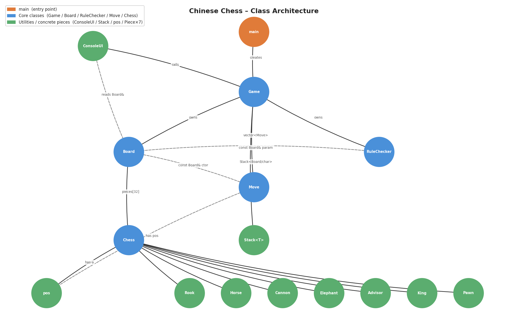

# 中国象棋 (Chinese Chess)

基于终端的 C++ 中国象棋游戏，完整实现象棋规则，支持悔棋和跨平台彩色输出。



---

## 功能特性

- 完整实现七种棋子的象棋规则
- 将军、将死、逼将（困毙）判断
- 无限步数悔棋
- ANSI 彩色终端输出（支持 Windows Terminal、macOS、Linux）
- 跨平台：Windows / macOS / Linux
- 清晰的 MVC 分层架构，模块职责分明

---

## 快速开始

### 环境要求

- 支持 C++17 的编译器（g++、clang++ 或 MSVC）
- 支持 UTF-8 和 ANSI 颜色的终端（Windows Terminal、iTerm2、GNOME Terminal 等）

### 编译

**Linux / macOS**
```bash
g++ -std=c++17 -o ChineseChess main.cpp \
    Board/"Board source.cpp" \
    ConsoleUI/ConsoleUI.cpp \
    Game/Game.cpp \
    Move/Move.cpp \
    Piece/"Chess source.cpp" \
    Piece/"Advisor source.cpp" \
    Piece/"Cannon source.cpp" \
    Piece/"Elephant source.cpp" \
    Piece/"Horse souce.cpp" \
    Piece/King.cpp \
    Piece/"Pawn source.cpp" \
    Piece/"Rook source.cpp" \
    RuleChecker/RuleChecker.cpp \
    Stack/Stack.cpp
```

**Windows（cmd）**
```cmd
run-game.cmd
```

**Windows（PowerShell）**
```powershell
.\run-game.ps1
```

### 运行

```bash
./ChineseChess
```

---

## 游戏操作

棋盘坐标以 `(0,0)` 为左下角（红方底线）。

**输入格式：** `x1 y1 x2 y2`

例如，`0 0 0 1` 表示将 (0,0) 处的棋子移动到 (0,1)。

| 命令 | 说明 |
|---|---|
| `x1 y1 x2 y2` | 将棋子从 (x1,y1) 移到 (x2,y2) |
| `u` 或 `undo` | 悔棋（撤销上一步） |
| `q` 或 `quit` | 退出游戏 |

红方先行。一方将帅被将死或无合法走法时游戏结束。

---

## 项目结构

```
ChineseChess/
├── main.cpp                        # 程序入口
├── Board/                          # 棋盘状态与深拷贝
│   ├── Board.h
│   └── Board source.cpp
├── Piece/                          # 抽象棋子基类 + 7 种具体棋子
│   ├── Chess.h / Chess source.cpp  # 抽象基类
│   ├── King.h / King.cpp           # 将 / 帅
│   ├── Advisor.h / Advisor source.cpp   # 士 / 仕
│   ├── Elephant.h / Elephant source.cpp # 象 / 相
│   ├── Horse.h / Horse souce.cpp   # 马 / 傌
│   ├── Rook.h / Rook source.cpp    # 车 / 俥
│   ├── Cannon.h / Cannon source.cpp     # 炮 / 砲
│   └── Pawn.h / Pawn source.cpp    # 兵 / 卒
├── Move/                           # 棋步记录结构体
│   ├── Move.h
│   └── Move.cpp
├── RuleChecker/                    # 无状态规则引擎
│   ├── RuleChecker.h
│   └── RuleChecker.cpp
├── Stack/                          # 手写泛型栈（悔棋快照用）
│   ├── Stack.h
│   └── Stack.cpp
├── ConsoleUI/                      # 终端 I/O（View 层）
│   ├── ConsoleUI.h
│   └── ConsoleUI.cpp
└── Game/                           # 游戏循环与状态机（Controller 层）
    ├── Game.h
    └── Game.cpp
```

---

## 架构设计

项目采用 MVC 分层架构：

```
main
 └─ Game::run()            ← Controller：游戏循环与状态机
      ├─ ConsoleUI          ← View：所有终端 I/O，不含游戏逻辑
      ├─ Board              ← Model：棋盘状态，支持深拷贝快照
      ├─ RuleChecker        ← Model：无状态规则引擎
      ├─ Stack<Board/char>  ← 悔棋历史快照栈
      └─ vector<Move>       ← 棋步历史记录
```

**关键设计决策：**

- **多态**：`Chess` 是抽象基类，每个棋子重写 `is_legal(pos, pos, const Board&)`，棋盘以 `Chess*` 指针数组存储所有棋子。
- **快照式悔棋**：每次合法落子前，将整个 `Board` 对象深拷贝压入 `Stack<Board>`，悔棋时弹出恢复，实现简洁正确。
- **试走验证**：`RuleChecker::is_move_legal` 在棋盘副本上执行走法，再检查是否导致己方被将，统一处理所有"送将"场景，无需特殊情况处理。
- **无状态规则引擎**：`RuleChecker` 没有成员变量，所有方法接受 `const Board&` 参数且被 `const` 修饰，可安全递归调用（如 `has_any_legal_move` 内部）。
- **跨平台控制台**：`ConsoleUI` 用 `#ifdef _WIN32` 宏分离 WinAPI（UTF-8 编码 + 虚拟终端支持）与 ANSI 转义序列两套路径，不支持颜色时优雅降级。

---

## 棋子走法

| 棋子 | 走法说明 |
|---|---|
| 将 / 帅 | 每次走一步，横或纵，必须留在九宫内；双方将帅不能同列无阻直接对面 |
| 士 / 仕 | 斜走一步，必须留在九宫内 |
| 象 / 相 | 斜走两步（田字形），不能过河，象眼处有棋子则不能走（憋象眼） |
| 马 / 傌 | 一横一斜（日字形），起步方向有棋子则不能走（蹩马腿） |
| 车 / 俥 | 横纵任意步数，路径必须无阻挡 |
| 炮 / 砲 | 移动同车；**吃子必须跳过且只能跳过一个棋子（炮架）** |
| 兵 / 卒 | 未过河只能向前一步；过河后可向前或左右走一步 |

---

## 开源协议

本项目基于 [MIT License](LICENSE) 开源。
